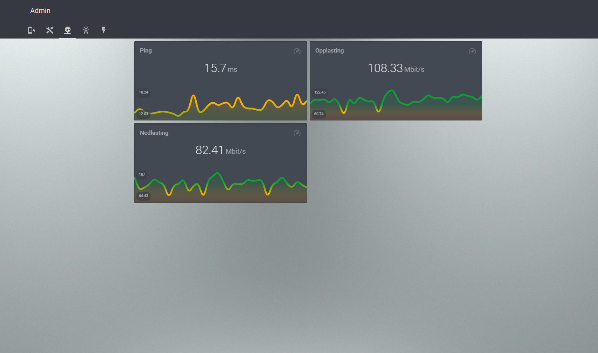

# home-assistant-core-s71
# Devices
* [Fibaro dimmers](https://www.fibaro.com/no/products/dimmer-2-lysstyrkekontroll/)
* [Fibaro switches](https://www.fibaro.com/no/products/switches/)
* [Fibaro wall plugs](https://www.fibaro.com/no/products/smart-stikkontakt-wall-plug/)
* [Fibaro motion sensor](https://www.fibaro.com/no/products/bevegelsessensor-motion-sensor/)
* [Fibaro door / window sensor](https://www.fibaro.com/no/products/door-window-sensor/)
* [Heatit z-wave thermostat](https://www.heatit.com/heating-control/floor-heating-thermostats/heatit-z-wave-thermostat/)
* [Tibber](https://tibber.com/no/)
* [Netatmo Weather station](https://www.netatmo.com/no-no/weather/weatherstation)
* [Ring Doorbell 2](https://shop.ring.com/products/video-doorbell-2)
* [Home Connect](https://www.home-connect.com/no/no/)
* [Xiaomi Roborock](https://en.roborock.com/)
* [IKEA Trådfri rullgardin](https://www.ikea.com/no/no/p/fyrtur-lystett-rullegardin-tradlos-batteridrevet-gra-90408170/)
* [Speedtest.net](https://www.speedtest.net/)

# Images

